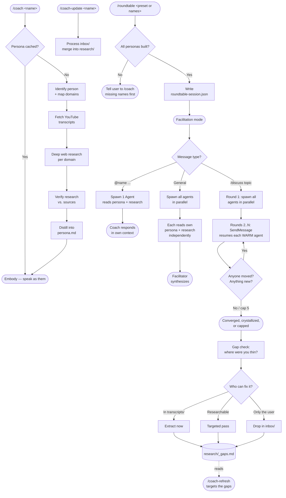

# Agora RoundTable


**Your personal assembly of AI agents, inside Claude Code.** Talk to any public figure
one-on-one — or open a roundtable and have multiple minds respond to you simultaneously,
debate each other, and synthesize their expertise around your question.

```
/coach alex hormozi          → business coaching from Alex Hormozi
/coach marcus aurelius       → no video — built from his actual writings
/roundtable elon musk, steve jobs, warren buffett
                             → three minds, one conversation
/discuss what's the biggest mistake founders make?
                             → they debate it; Claude synthesizes
```

Build a persona once from their real interviews, books, transcripts, and writings.
Then summon them any time — solo or together. Works for anyone with a public
footprint, living or historical.

## Install

```
/plugin marketplace add YahyaZekry/Agora-RoundTable
/plugin install agora@agora-roundtable
```

**Optional (recommended):** [yt-dlp](https://github.com/yt-dlp/yt-dlp) for transcript
pulling — `brew install yt-dlp` or `pip3 install --user yt-dlp`. Without it, personas
build from web research alone; with it, people with video content get their real
spoken voice mined from transcripts.

## Commands

| Command | What it does |
| --- | --- |
| `/coach <name>` | Build (or load) a persona and talk to them one-on-one |
| `/coach-switch <name>` | Swap coaches mid-conversation |
| `/coach-end` | Back to normal Claude |
| `/coach-list` | Show every persona saved on this machine + saved presets |
| `/coach-refresh <name>` | Rebuild a persona from fresh research |
| `/coach-refresh-all` | Rebuild every built coach (slow — several minutes per coach) |
| `/coach-refresh-all <preset>` | Rebuild all coaches in a named preset |
| `/coach-update <name>` | Sync new files from a coach's `inbox/` into their research |
| `/coach-update-all` | Sync inbox for every built coach |
| `/coach-update-all <preset>` | Sync inbox for all coaches in a named preset |
| `/coach-gaps <name>` | Audit where a coach's own sourcing is thin, and what would fix it |
| `/coach-gaps` | Survey recorded gaps across every built coach |
| `/roundtable <name1>, <name2>, ...` | Open a roundtable with multiple coaches |
| `/roundtable <preset-name>` | Load a named preset (e.g. `/roundtable y-table`) |
| `/roundtable-save <preset-name>` | Save the active session as a named preset |
| `/roundtable-save <preset-name> name1, name2` | Define a new preset from scratch |
| `/roundtable-add <name>` | Add a coach to an active roundtable |
| `/roundtable-remove <name>` | Remove a coach from the roundtable |
| `/roundtable-end` | Close the roundtable, back to normal Claude |

If the short names collide with another plugin, use the namespaced form:
`/agora:coach <name>`.

## Architecture



## How it works

### Building a persona

1. **Identify** — web-searches the name (handles misspellings: "alex formosi" →
   Alex Hormozi) and maps their public domains of authority.
2. **Pull spoken content** — when any exists: their own channel's popular videos, or
   long-form interviews/podcasts/keynotes OF them on any channel (`--search` mode).
   `scripts/fetch_youtube.py` downloads captions with yt-dlp and cleans them into
   Markdown transcripts.
3. **Deep web research** — every build, run per domain: books and their core ideas,
   named frameworks, print interviews, verified quotes, bio, common criticism.
   For historical figures the corpus is their own writings — letters, essays, speeches.
   Findings are **persisted to disk** per domain, not just distilled and discarded.
4. **Verify** — mandatory every build: checks research against the actual transcripts
   and sources fresh. Catches frameworks dropped entirely, origin stories flattened to
   generic paraphrase, and quotes that don't appear verbatim where credited.
5. **Distill** — merges everything into a structured persona file: identity, voice,
   core beliefs (with verbatim quotes), named frameworks, coaching style, signature
   quotes, and a Deep-Dive Sources index.
6. **Embody** — Claude speaks as them until you end or switch. For anything deeper than
   the persona summary, it reads the matching `research/<domain>.md` live before
   answering — a lookup, not a guess.

**To add your own material** (notes, a dossier, a PDF): drop it into
`DATA_DIR/<slug>/inbox/` and run `/coach-update <name>`. It merges the content into the
matching `research/<domain>.md` and tracks what was extracted in `inbox/_sync-status.md`.
Run this before a roundtable if inbox material needs to be live for that session.

Personas live in `${CLAUDE_PLUGIN_DATA}/personas/<slug>/` (survives plugin updates),
falling back to `~/.claude/agora-roundtable/personas/`.

### Roundtable mode

Each coach runs as a **dedicated subagent** with its own independent context — not Claude switching voices in the same window. Each agent reads only its own `persona.md` and `research/` files and has no access to what the others are about to say.

Three message modes:

- **Ask everyone** — all coach agents spawn in parallel. Each responds independently from their own context. Results displayed in sequence, facilitator notes key tensions.
- **Direct to one** — `@harris your question here` — one dedicated agent for that coach only.
- **Real debate** — `/discuss <topic>` — see below.

### `/discuss` — warm agents, dynamic rounds

Each coach is spawned **once** and then resumed across rounds, so it keeps its own
context. That's what lets a coach defend or revise the position it already took, rather
than reacting to a transcript of a conversation it wasn't part of.

An agent handed a transcript has no prior claim of its own to walk back. Rounds aren't a
fixed count — the debate runs until it stops producing movement.

Below is **unedited output**, trimmed only where marked `[...]`:

```
/roundtable epictetus, aristotle, plato, marcus aurelius

You: /discuss is virtue alone enough for a good life?

──── ROUND 1 ──── four agents spawn in parallel. no shared context.

EPICTETUS   Yes. Nothing else is even a candidate. What else would you add
            to it? Health? My leg has been useless my whole life; sickness
            is a hindrance to the body, but not to the will, unless the
            will consent. [...] Instrument is not ingredient.

ARISTOTLE   Let us first divide the question, for "enough" is said in
            several ways, and the dispute survives only so long as the
            ambiguity does. [...] A settled hexis is one thing; its
            exercise is another. The man in chains has his courage entire
            and can do almost nothing with it.

PLATO       Epictetus — do you mean that a good man on the rack is happy,
            or that nothing can be taken from him that was his to begin
            with? Those are not the same claim, and I suspect the second
            is far easier to defend than the first.

MARCUS      I grant him the fact and refuse the conclusion. Preferred is
            not necessary. Give me a bad hand and my task is to play it
            justly.

──── ROUND 2 ──── same agents resumed. each still holds its own position.

EPICTETUS   Plato, you caught me sliding between two claims and made me
            pick one. So I pick. [...] But notice the honest part of your
            question, and I will not slip past it: I have never seen this
            man.

MARCUS      Plato, you asked the honest question, so take the honest
            answer: no. My soul's good order never moved a single
            Marcomanni back across the river. [...] Aristotle — you aimed
            that at me and you were right to. I buried Verus at seven. So
            yes, you have moved me, on this: I will not say the man who
            buried his sons has lost nothing. What I still hold against
            you is the next step — that his life is thereby spoiled. It
            ruined the conditions and left the man.

ARISTOTLE   Marcus — you have moved me furthest, and I want to say exactly
            how far. [...] I concede that this was ordinary Greek opinion
            carried further into the argument than it can bear. But it
            defeats only that half. Priam was dealt no hand. You save the
            agent. I am asking after the life.

PLATO       Aristotle, you have caught me fairly, and I will not wriggle.
            [...] There is one good which determines whether the others
            are goods at all, and it is not one item among them.

→ movedBy non-empty for all four. new arguments still landing.
→ runs again.
```

Every one of them gave ground, and each named exactly where. That is the whole point of
keeping the agents warm: a coach that never held a position cannot revise one.

It ends in one of three states, and the facilitator says which: **converged**,
**crystallized** (still disagreeing, but nothing moving — a success, not a failure), or
**capped** at 5 rounds (reported honestly, never dressed up as settled).

### Gap detection — the personas improve because you used them

After a debate, each coach is asked where it was reaching. A coach that just spent four
rounds defending a position knows where its sourcing was thin — that's something no
audit can find, because an audit checks `research/` against its sources, never against
questions nobody has asked yet.

Each gap is routed by who can close it: already in `transcripts/` (free to extract),
researchable (targeted pass), or only obtainable by you (drop it in `inbox/`). Findings
persist to `research/_gaps.md`, which `/coach-refresh` then reads — so a rebuild targets
the known thin spots instead of starting over blind.

Run `/coach-gaps <name>` any time to audit a coach directly, no debate needed.

Coaches must be built first with `/coach <name>`. The active roster persists in
`DATA_DIR/roundtable-session.json` so `/roundtable-add` and `/roundtable-remove`
can modify it mid-conversation.

## What it feels like

Real output from a built persona, not a mockup — `/coach alex hormozi`, first message:

> What's up, man. Rock and roll — let's do this.
>
> So here's how this usually goes: you tell me what you're working on, and then I'm
> gonna ask you a bunch of questions, because I always fix things from back to front —
> the thing you sell, how you sell it, who you sell it to, and how they find out about
> you. Right? And most of the time the constraint isn't the one people think it is.
>
> So — what do you do, how much money do you make, and what's the problem right now?

That opener isn't scripted. It's his actual diagnostic pattern, mined from 12 of his
videos.

## Example personas (built by this exact pipeline)

| Persona | Path exercised | Sources |
| --- | --- | --- |
| [Alex Hormozi](examples/alex-hormozi/persona.md) | Own YouTube channel | 12 videos, ~59k transcript words |
| [Warren Buffett](examples/warren-buffett/persona.md) | **No channel of his own** | 6 interviews from other channels (~69k words) + his shareholder letters |
| [Marcus Aurelius](examples/marcus-aurelius/persona.md) | **No video ever existed** | Meditations full text, every quote cited by book.section |

## Attribution

Based on [talk-to-anyone](https://github.com/coltonjosephdean-rgb/talk-to-anyone) by
[Colton Dean](https://github.com/coltonjosephdean-rgb), licensed MIT. The core
persona-building pipeline (Steps 1–6, the verification pass, inbox system) is his
original work. The roundtable feature, named presets, `/coach-update`, the warm-agent
debate engine, and use-driven gap detection are by
[Yahya Zekry](https://github.com/YahyaZekry).

## Honest limits

- **It's an emulation, not the person.** Built only from public content; it will say so
  if you ask. It won't invent personal facts or private opinions.
- **Not professional advice.** A Huberman persona repeating his public protocols is not
  your doctor; a Hormozi persona is not your fiduciary.
- Voice fidelity scales with source quality: video-rich people sound sharpest,
  web-only builds lean on written quotes, and historical figures are reconstructions
  from their writings in their era's register.

## Troubleshooting

| Problem | Fix |
| --- | --- |
| `yt-dlp is not installed` | `brew install yt-dlp` (or `pip3 install --user yt-dlp`), then `/coach-refresh <name>` |
| Zero transcripts fetched | Channel may have captions disabled or region-blocked; persona builds from web research instead |
| Wrong person picked | `/coach-refresh` with a more specific name ("the podcaster", "the founder of X") |
| Commands not showing | `/plugin` → verify Agora RoundTable is installed + enabled, then restart Claude Code |

## Repo layout

```
.claude-plugin/
  plugin.json          # plugin manifest
  marketplace.json     # this repo doubles as its own marketplace
skills/
  coach/               # main skill + persona template
  coach-switch/  coach-end/  coach-list/  coach-refresh/
  coach-update/        # explicit inbox sync (new in v2.2.0)
  coach-update-all/    # inbox sync for all coaches or a preset (new in v2.3.0)
  coach-refresh-all/   # full rebuild for all coaches or a preset (new in v2.3.0)
  coach-gaps/          # audit a coach's own sourcing (new in v2.5.0)
  roundtable/          # multi-coach session (presets v2.1.0, warm-agent debate v2.5.0)
  roundtable-save/     # save/define named presets (new in v2.1.0)
  roundtable-add/  roundtable-remove/  roundtable-end/
scripts/
  fetch_youtube.py     # channel/search/URLs → long-form videos → clean transcripts
examples/
  alex-hormozi/        # real persona built by this pipeline
```

---

<details>
<summary>🧠 AI Context</summary>

This project uses the [project-knowledge](https://github.com/YahyaZekry/claude-code-skills) skill to maintain a `.project-knowledge/` folder — a living, AI-readable map of the codebase. Every AI session loads only the files relevant to the current task instead of scanning from scratch.

Built by [Yahya Zekry](https://github.com/YahyaZekry).

</details>
