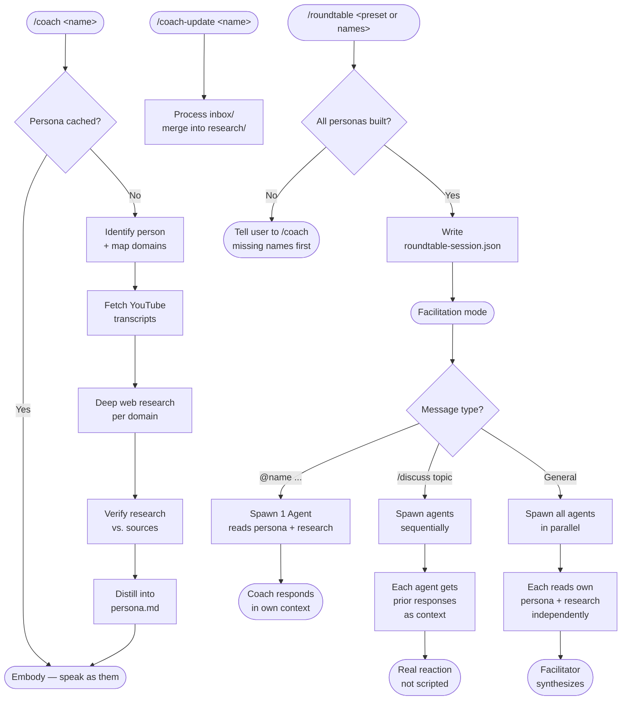

# Agora RoundTable


**Your personal assembly of AI agents, inside Claude Code.** Talk to any public figure
one-on-one — or open a roundtable and have multiple minds respond to you simultaneously,
debate each other, and synthesize their expertise around your question.

```
/coach alex hormozi          → business coaching from Alex Hormozi
/coach marcus aurelius       → no video — built from his actual writings
/roundtable elon musk, steve jobs, warren buffett
                             → three minds, one conversation
/discuss what's the biggest mistake founders make?
                             → they debate it; Claude synthesizes
```

Build a persona once from their real interviews, books, transcripts, and writings.
Then summon them any time — solo or together. Works for anyone with a public
footprint, living or historical.

## Install

```
/plugin marketplace add YahyaZekry/Agora-RoundTable
/plugin install agora-roundtable@agora-roundtable
```

**Optional (recommended):** [yt-dlp](https://github.com/yt-dlp/yt-dlp) for transcript
pulling — `brew install yt-dlp` or `pip3 install --user yt-dlp`. Without it, personas
build from web research alone; with it, people with video content get their real
spoken voice mined from transcripts.

## Commands

| Command | What it does |
| --- | --- |
| `/coach <name>` | Build (or load) a persona and talk to them one-on-one |
| `/coach-switch <name>` | Swap coaches mid-conversation |
| `/coach-end` | Back to normal Claude |
| `/coach-list` | Show every persona saved on this machine + saved presets |
| `/coach-refresh <name>` | Rebuild a persona from fresh research |
| `/coach-refresh-all` | Rebuild every built coach (slow — several minutes per coach) |
| `/coach-refresh-all <preset>` | Rebuild all coaches in a named preset |
| `/coach-update <name>` | Sync new files from a coach's `inbox/` into their research |
| `/coach-update-all` | Sync inbox for every built coach |
| `/coach-update-all <preset>` | Sync inbox for all coaches in a named preset |
| `/roundtable <name1>, <name2>, ...` | Open a roundtable with multiple coaches |
| `/roundtable <preset-name>` | Load a named preset (e.g. `/roundtable y-table`) |
| `/roundtable-save <preset-name>` | Save the active session as a named preset |
| `/roundtable-save <preset-name> name1, name2` | Define a new preset from scratch |
| `/roundtable-add <name>` | Add a coach to an active roundtable |
| `/roundtable-remove <name>` | Remove a coach from the roundtable |
| `/roundtable-end` | Close the roundtable, back to normal Claude |

If the short names collide with another plugin, use the namespaced form:
`/agora-roundtable:coach <name>`.

## Architecture



## How it works

### Building a persona

1. **Identify** — web-searches the name (handles misspellings: "alex formosi" →
   Alex Hormozi) and maps their public domains of authority.
2. **Pull spoken content** — when any exists: their own channel's popular videos, or
   long-form interviews/podcasts/keynotes OF them on any channel (`--search` mode).
   `scripts/fetch_youtube.py` downloads captions with yt-dlp and cleans them into
   Markdown transcripts.
3. **Deep web research** — every build, run per domain: books and their core ideas,
   named frameworks, print interviews, verified quotes, bio, common criticism.
   For historical figures the corpus is their own writings — letters, essays, speeches.
   Findings are **persisted to disk** per domain, not just distilled and discarded.
4. **Verify** — mandatory every build: checks research against the actual transcripts
   and sources fresh. Catches frameworks dropped entirely, origin stories flattened to
   generic paraphrase, and quotes that don't appear verbatim where credited.
5. **Distill** — merges everything into a structured persona file: identity, voice,
   core beliefs (with verbatim quotes), named frameworks, coaching style, signature
   quotes, and a Deep-Dive Sources index.
6. **Embody** — Claude speaks as them until you end or switch. For anything deeper than
   the persona summary, it reads the matching `research/<domain>.md` live before
   answering — a lookup, not a guess.

**To add your own material** (notes, a dossier, a PDF): drop it into
`DATA_DIR/<slug>/inbox/` and run `/coach-update <name>`. It merges the content into the
matching `research/<domain>.md` and tracks what was extracted in `inbox/_sync-status.md`.
Run this before a roundtable if inbox material needs to be live for that session.

Personas live in `${CLAUDE_PLUGIN_DATA}/personas/<slug>/` (survives plugin updates),
falling back to `~/.claude/agora-roundtable/personas/`.

### Roundtable mode

Each coach runs as a **dedicated subagent** with its own independent context — not Claude switching voices in the same window. Each agent reads only its own `persona.md` and `research/` files and has no access to what the others are about to say.

Three message modes:

- **Ask everyone** — all coach agents spawn in parallel. Each responds independently from their own context. Results displayed in sequence, facilitator notes key tensions.
- **Direct to one** — `@harris your question here` — one dedicated agent for that coach only.
- **Facilitated discussion** — `/discuss <topic>` — agents run sequentially: coach 2 receives coach 1's actual response as context before responding, coach 3 gets both, and so on. Real reaction, not a scripted exchange.

```
/roundtable thomas harris, gillian flynn, dennis lehane

You: /discuss whose POV should the first scene use?

→ Harris agent spawns, reads persona + research, responds
→ Flynn agent spawns, reads persona + research, receives Harris's response, reacts
→ Lehane agent spawns, reads persona + research, receives both, responds

[Facilitator: where they agreed, where they diverged, what it means for your decision]
```

Coaches must be built first with `/coach <name>`. The active roster persists in
`DATA_DIR/roundtable-session.json` so `/roundtable-add` and `/roundtable-remove`
can modify it mid-conversation.

## What it feels like

Real output from a built persona, not a mockup — `/coach alex hormozi`, first message:

> What's up, man. Rock and roll — let's do this.
>
> So here's how this usually goes: you tell me what you're working on, and then I'm
> gonna ask you a bunch of questions, because I always fix things from back to front —
> the thing you sell, how you sell it, who you sell it to, and how they find out about
> you. Right? And most of the time the constraint isn't the one people think it is.
>
> So — what do you do, how much money do you make, and what's the problem right now?

That opener isn't scripted. It's his actual diagnostic pattern, mined from 12 of his
videos.

## Example personas (built by this exact pipeline)

| Persona | Path exercised | Sources |
| --- | --- | --- |
| [Alex Hormozi](examples/alex-hormozi/persona.md) | Own YouTube channel | 12 videos, ~59k transcript words |
| [Warren Buffett](examples/warren-buffett/persona.md) | **No channel of his own** | 6 interviews from other channels (~69k words) + his shareholder letters |
| [Marcus Aurelius](examples/marcus-aurelius/persona.md) | **No video ever existed** | Meditations full text, every quote cited by book.section |

## Attribution

Based on [talk-to-anyone](https://github.com/coltonjosephdean-rgb/talk-to-anyone) by
[Colton Dean](https://github.com/coltonjosephdean-rgb), licensed MIT. The core
persona-building pipeline (Steps 1–6, the verification pass, inbox system) is his
original work. The roundtable feature, named presets, and `/coach-update` are by
[Yahya Zekry](https://github.com/YahyaZekry).

## Honest limits

- **It's an emulation, not the person.** Built only from public content; it will say so
  if you ask. It won't invent personal facts or private opinions.
- **Not professional advice.** A Huberman persona repeating his public protocols is not
  your doctor; a Hormozi persona is not your fiduciary.
- Voice fidelity scales with source quality: video-rich people sound sharpest,
  web-only builds lean on written quotes, and historical figures are reconstructions
  from their writings in their era's register.

## Troubleshooting

| Problem | Fix |
| --- | --- |
| `yt-dlp is not installed` | `brew install yt-dlp` (or `pip3 install --user yt-dlp`), then `/coach-refresh <name>` |
| Zero transcripts fetched | Channel may have captions disabled or region-blocked; persona builds from web research instead |
| Wrong person picked | `/coach-refresh` with a more specific name ("the podcaster", "the founder of X") |
| Commands not showing | `/plugin` → verify agora-roundtable is installed + enabled, then restart Claude Code |

## Repo layout

```
.claude-plugin/
  plugin.json          # plugin manifest
  marketplace.json     # this repo doubles as its own marketplace
skills/
  coach/               # main skill + persona template
  coach-switch/  coach-end/  coach-list/  coach-refresh/
  coach-update/        # explicit inbox sync (new in v2.2.0)
  coach-update-all/    # inbox sync for all coaches or a preset (new in v2.3.0)
  coach-refresh-all/   # full rebuild for all coaches or a preset (new in v2.3.0)
  roundtable/          # multi-coach session (named presets: v2.1.0)
  roundtable-save/     # save/define named presets (new in v2.1.0)
  roundtable-add/  roundtable-remove/  roundtable-end/
scripts/
  fetch_youtube.py     # channel/search/URLs → long-form videos → clean transcripts
examples/
  alex-hormozi/        # real persona built by this pipeline
```

---

<details>
<summary>🧠 AI Context</summary>

This project uses the [project-knowledge](https://github.com/YahyaZekry/claude-code-skills) skill to maintain a `.project-knowledge/` folder — a living, AI-readable map of the codebase. Every AI session loads only the files relevant to the current task instead of scanning from scratch.

Built by [Yahya Zekry](https://github.com/YahyaZekry).

</details>
