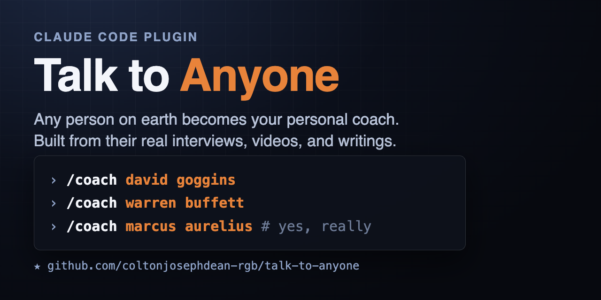
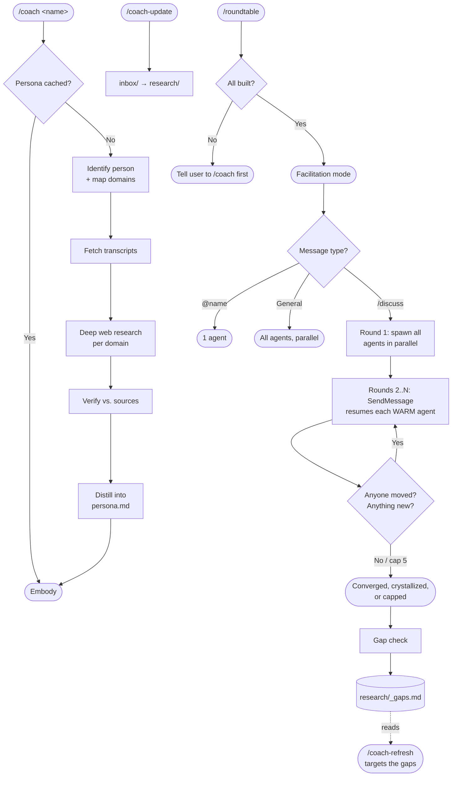

# Agora RoundTable



**Your personal assembly of AI agents.** Talk to any public figure one-on-one, or seat
several at a table and let them argue with each other until the argument stops moving.

Runs on **Claude Code** and **OpenCode**, sharing the same personas.

```
/coach marcus aurelius                    → built from his actual writings
/roundtable epictetus, aristotle, plato   → three minds, independent contexts
/discuss is virtue alone enough?          → they debate; each can change its mind
```

Works for anyone with a public footprint, living or historical.

## Contents

| | |
| --- | --- |
| [Install](#install) | Claude Code or OpenCode, plus optional yt-dlp |
| [Commands](#commands) | All 15, one table |
| [See it work](#see-it-work) | Real unedited debate output |
| [How `/discuss` works](#how-discuss-works) | Why they can change their minds |
| [Gap detection](#gap-detection) | Coaches admit what they don't know |
| [Working with your own files](#working-with-your-own-files) | `inbox/`, `research/`, and PDFs |
| [Building a persona](#building-a-persona) | The six-step pipeline |
| [Architecture](#architecture) | Flow diagram |
| [Limits & troubleshooting](#limits--troubleshooting) | What it won't do |

## Install

**Claude Code:**

```
/plugin marketplace add YahyaZekry/Agora-RoundTable
/plugin install agora@agora-roundtable
```

**OpenCode:**

```
git clone https://github.com/YahyaZekry/Agora-RoundTable
bash Agora-RoundTable/opencode-plugin/install.sh
```

Commands are the same, prefixed: `/agora coach`, `/agora roundtable`, `/agora discuss`.
The installer symlinks into `~/.config/opencode`, so the repo stays the source of truth,
and it points at Claude's personas directory when it finds one. **A coach built in either
one works in the other** — same persona format, same folder.

**Optional, both:** [yt-dlp](https://github.com/yt-dlp/yt-dlp). Run `brew install yt-dlp`
or `pip3 install --user yt-dlp`. Without it personas build from web research alone; with
it, anyone with video gets their real spoken voice mined from transcripts.

## Commands

| Command | What it does |
| --- | --- |
| `/coach <name>` | Build or load a persona, talk one-on-one |
| `/coach-switch <name>` · `/coach-end` · `/coach-list` | Swap · exit · list personas and presets |
| `/coach-refresh <name>` | Rebuild from fresh research |
| `/coach-update <name>` | Sync new files from their `inbox/` into research |
| `/coach-gaps [name]` | Audit where a coach's sourcing is thin |
| `/roundtable <names or preset>` | Open a multi-coach session |
| `/discuss <topic>` | Run a real multi-round debate |
| `/roundtable-save <preset>` | Save the active roster as a named preset |
| `/roundtable-add` · `/roundtable-remove` · `/roundtable-end` | Manage the table |
| `/coach-refresh-all` · `/coach-update-all` | Same, across every coach or a preset |

Namespaced form if names collide on Claude Code: `/agora:coach <name>`. On OpenCode every
command is `/agora <command>` already.

## See it work

Four philosophers, two rounds, on whether virtue alone suffices. By round two **every one
of them had conceded ground**, and each named exactly where:

> **Aristotle** — *"you have moved me furthest, and I want to say exactly how far."*
> **Marcus Aurelius** — *"you have moved me, on this: I will not say the man who buried his sons has lost nothing."*
> **Epictetus** — *"you caught me sliding between two claims and made me pick one. So I pick."*
> **Plato** — *"you have caught me fairly, and I will not wriggle."*

That only happens because each agent still remembers the position it took in round one.

<details>
<summary><b>Read the full exchange</b> (unedited, trimmed only where marked <code>[...]</code>)</summary>

```
/roundtable epictetus, aristotle, plato, marcus aurelius

──── ROUND 1 ──── four agents spawn in parallel. no shared context.

EPICTETUS   Yes. Nothing else is even a candidate. What else would you add
            to it? Health? My leg has been useless my whole life; sickness
            is a hindrance to the body, but not to the will, unless the
            will consent. [...] Instrument is not ingredient.

ARISTOTLE   Let us first divide the question, for "enough" is said in
            several ways, and the dispute survives only so long as the
            ambiguity does. [...] A settled hexis is one thing; its
            exercise is another. The man in chains has his courage entire
            and can do almost nothing with it.

PLATO       Epictetus — do you mean that a good man on the rack is happy,
            or that nothing can be taken from him that was his to begin
            with? Those are not the same claim, and I suspect the second
            is far easier to defend than the first.

MARCUS      I grant him the fact and refuse the conclusion. Preferred is
            not necessary. Give me a bad hand and my task is to play it
            justly.

──── ROUND 2 ──── same agents resumed. each still holds its own position.

EPICTETUS   Plato, you caught me sliding between two claims and made me
            pick one. So I pick. [...] But notice the honest part of your
            question, and I will not slip past it: I have never seen this
            man.

MARCUS      Plato, you asked the honest question, so take the honest
            answer: no. My soul's good order never moved a single
            Marcomanni back across the river. [...] Aristotle — you aimed
            that at me and you were right to. I buried Verus at seven. So
            yes, you have moved me, on this: I will not say the man who
            buried his sons has lost nothing. What I still hold against
            you is the next step — that his life is thereby spoiled. It
            ruined the conditions and left the man.

ARISTOTLE   Marcus — you have moved me furthest, and I want to say exactly
            how far. [...] I concede that this was ordinary Greek opinion
            carried further into the argument than it can bear. But it
            defeats only that half. Priam was dealt no hand. You save the
            agent. I am asking after the life.

PLATO       Aristotle, you have caught me fairly, and I will not wriggle.
            [...] There is one good which determines whether the others
            are goods at all, and it is not one item among them.

→ movedBy non-empty for all four. new arguments still landing.
→ runs again.
```

</details>

## How `/discuss` works

Each coach is a separate AI agent with its own memory. They do not share a brain. Each one
reads only its own `persona.md` and `research/` files, so nobody knows what the others are
about to say.

The important part: each agent is created once and stays alive for the whole debate. So
when Aristotle gets pushed in round two, he remembers what he argued in round one and can
defend it or take it back. An agent that gets handed a transcript of an argument it was
not in can only agree or disagree. It has no position of its own to change.

There is no fixed number of rounds. It keeps going while anyone is still changing their
mind or raising something new, and stops when a whole round passes with neither. Maximum
5 rounds.

It ends one of three ways, and it tells you which:

- **They agree.** Or they found an answer together.
- **They still disagree, but nothing is moving.** This counts as done, not as failure.
  Two experts with fully worked-out opposite positions is usually more useful than forcing
  them to average out.
- **It hit 5 rounds.** Says so plainly instead of pretending it was settled.

Other ways to talk to the table: just type a question and everyone answers, or `@plato
your question` to ask one of them.

## Gap detection

After a debate, each coach is asked one more question: where were you making it up?

A coach that just spent four rounds defending a position knows where it was reaching. It
felt the weak spot. You cannot find that by auditing the files, because an audit only
checks what is written against its sources. It cannot check for things nobody has asked
about yet.

Gaps are written to `research/_gaps.md`. **`/coach-update` closes all of them**, and it
never deletes or rebuilds anything. It works through them cheapest first:

1. **Already in `transcripts/`.** The material is on your disk, it just never made it
   into `research/`. Pulled across immediately, costs nothing, never goes to the web.
2. **Only you can get it.** A specific book or paywalled piece. You put it in `inbox/`,
   and this is where it gets read.
3. **Never researched.** Needs a web search, so it asks you first, then researches only
   those topics and appends the results.

Run it even when your inbox is empty. It will still do step 1.

Run `/coach-gaps <name>` any time to ask a coach where it is thin. No debate needed.

## Working with your own files

Every coach has a folder. Two parts of it are yours to use.

### `inbox/` is where you put things in

Drop anything in there: notes, a dossier, a PDF, a saved article. Then run:

```
/coach-update marcus aurelius
```

It reads what you dropped, pulls the real content out, and writes it into the coach's
`research/` files. From then on the coach uses it when answering you.

Nothing happens automatically. Files sit in `inbox/` until you run `/coach-update`. That
is on purpose, so a big PDF is not reprocessed every time you start a session.

### `research/` is what the coach actually knows

One file per topic the person is known for. Marcus Aurelius has three:

```
research/dichotomy-of-control-and-judgment.md
research/duty-cosmopolitanism-and-difficult-people.md
research/memento-mori-and-present-moment.md
```

When you ask a question, the coach picks the file matching your topic and reads it before
answering. That is why answers can go deeper than the short persona summary.

These are plain markdown. Open and edit them yourself if something is wrong or missing.

### About PDFs

**Only the first 1 to 3 pages of a PDF are read by default.** PDFs are expensive in
tokens, and a 200-page book would cost an enormous amount for one coach.

Where those pages go: into the matching `research/<topic>.md` file, same as any other
source. A note is added saying which pages were read and how many are left, and
`inbox/_sync-status.md` marks the file **partial** instead of done, so a later pass knows
to continue.

**To read the whole PDF**, edit `skills/coach-update/SKILL.md`, line 49:

```
- **PDFs:** read only the first 1-3 pages (a `pages` range — never the whole file).
```

Change the range to what you want, or remove the limit. This is a real cost: a long book
read in full is a lot of tokens.

A cheaper option: split the PDF yourself, drop in only the chapters you care about, and
let it read those as separate files.

## Building a persona

<details>
<summary>The six-step pipeline</summary>

1. **Identify.** Web-searches the name (handles misspellings, e.g. "alex formosi" to Alex
   Hormozi) and maps their public domains of authority.
2. **Pull spoken content.** Their own channel, or long-form interviews of them on any
   channel. `scripts/fetch_youtube.py` cleans captions into Markdown transcripts.
3. **Deep web research.** Per domain: books, named frameworks, print interviews,
   verified quotes, bio, criticism. For historical figures the corpus is their own
   writings. Findings are **persisted to disk**, not distilled and discarded.
4. **Verify.** Mandatory every build. Catches frameworks dropped entirely, origin
   stories flattened to paraphrase, quotes that don't appear verbatim where credited,
   and claims with no source in the folder at all.
5. **Distill** into a structured persona file with a Deep-Dive Sources index.
6. **Embody.** For anything deeper than the summary it reads the matching
   `research/<domain>.md` live. A lookup, not a guess.

**Your own material:** drop notes, a dossier, or a PDF into `DATA_DIR/<slug>/inbox/` and
run `/coach-update <name>`.

Personas live in `${CLAUDE_PLUGIN_DATA}/personas/<slug>/`, falling back to
`~/.claude/agora-roundtable/personas/`.

**Examples built by this exact pipeline:**

| Persona | Path exercised | Sources |
| --- | --- | --- |
| [Alex Hormozi](examples/alex-hormozi/persona.md) | Own YouTube channel | 12 videos, ~59k words |
| [Warren Buffett](examples/warren-buffett/persona.md) | **No channel of his own** | 6 interviews elsewhere + shareholder letters |
| [Marcus Aurelius](examples/marcus-aurelius/persona.md) | **No video ever existed** | Meditations, every quote cited by book.section |

</details>

## Architecture

<details>
<summary>Flow diagram</summary>



</details>

<details>
<summary>Repo layout</summary>

```
.claude-plugin/     plugin.json + marketplace.json (repo is its own marketplace)
skills/             Claude Code — one folder per command
  coach/            main skill + persona template
  coach-switch/  coach-end/  coach-list/  coach-refresh/  coach-refresh-all/
  coach-update/  coach-update-all/
  coach-gaps/       audit a coach's own sourcing            (v2.5.0)
  roundtable/       presets v2.1.0, warm-agent debate       (v2.5.0)
  roundtable-save/  roundtable-add/  roundtable-remove/  roundtable-end/
opencode-plugin/    OpenCode port — same commands under /agora*
  install.sh        symlinks into ~/.config/opencode; links to Claude's personas if found
  commands/         one file per /agora command
  agents/           facilitator + hidden per-coach subagent
  lib/data-dir.js   where personas live — the one source of truth for both runtimes
scripts/
  fetch_youtube.py  channel/search/URLs → clean transcripts
examples/           real personas built by this pipeline
```

Both runtimes read and write the same persona folders, so a coach built in one is
immediately usable in the other.

</details>

## Limits & troubleshooting

It is an imitation, not the person. Built only from public material, and it will tell you
so if you ask. It will not invent private opinions or personal facts, and it is not advice
from a professional. A Huberman persona is not your doctor.

How good it sounds depends on the sources. People with a lot of video sound sharpest.
Historical figures are rebuilt from their writing, in the language of their time.

<details>
<summary>Common problems</summary>

| Problem | Fix |
| --- | --- |
| `yt-dlp is not installed` | `brew install yt-dlp`, then `/coach-refresh <name>` |
| Zero transcripts fetched | Captions disabled or region-blocked; persona builds from web research instead |
| Wrong person picked | `/coach-refresh` with a more specific name ("the founder of X") |
| Commands not showing (Claude Code) | `/plugin` → verify it's installed + enabled, then restart |
| Commands not showing (OpenCode) | re-run `opencode-plugin/install.sh`, then restart OpenCode |

</details>


---

<details>
<summary>🧠 AI Context</summary>

This project uses the [project-knowledge](https://github.com/YahyaZekry/project-knowledge-skill) skill to maintain a `.project-knowledge/` folder — a living, AI-readable map of the codebase. Every AI session loads only the files relevant to the current task instead of scanning from scratch.

Built by [Yahya Zekry](https://github.com/YahyaZekry).

</details>
